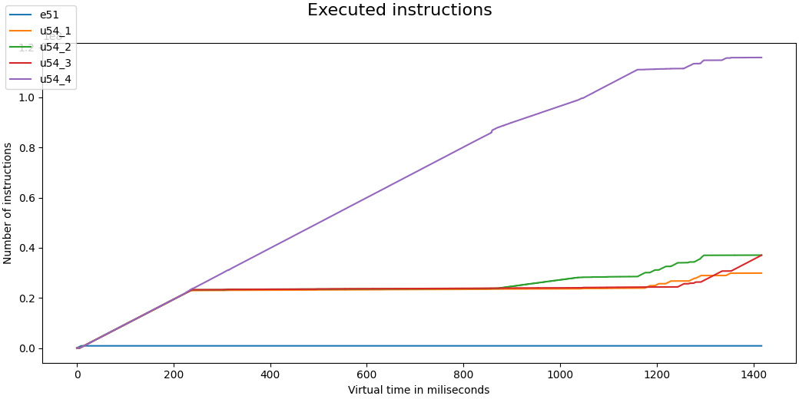

Metrics analyzer
================

Renode enables collecting execution data from the simulation and allows profiling the execution itself.
Currently supported execution metrics:

* executed instructions,
* memory accesses,
* peripheral accesses,
* exceptions.

Profiling
-------------

To enable profiling in Renode, type::

    (monitor) machine EnableProfiler "path_to_dump_file"

Run the simulation. The profiler is now collecting data from the metrics. Close Renode once this step is finished.
As a result, you will get a dump file with collected metrics.

The dump can be analyzed using the :rsrc:`metrics_parser Python library <tools/metrics_analyzer/metrics_parser/__init__.py>` or visualised with the provided helper script.

Visualizing
-------------

To display graph representations of the collected data by means of the visualizer bundled with Renode follow these steps:

Additional prerequisites
++++++++++++++++++++++++

To install prerequisites for the metrics visualization layer, run the following command from the root Renode directory ::

    python3 -m pip install --user -r tools/metrics_analyzer/metrics_visualizer/requirements.txt

Run script
+++++++++++++

Run the following script::

    python3 tools/metrics_analyzer/metrics_visualizer/metrics-visualizer.py path_to_dump_file

As a result, a window with graphs should appear, similar to the one presented below.

