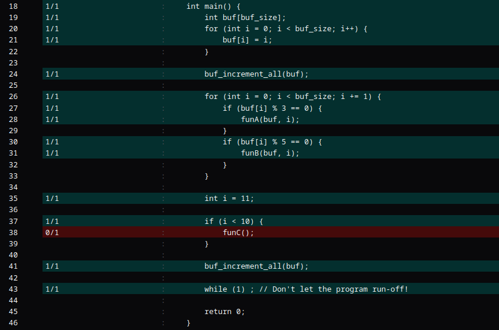
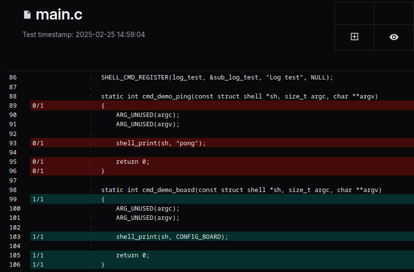

# Generating a coverage report

Renode offers many execution tracing features, as described in the [Execution tracing](./execution-tracing.md#execution-tracing) section, and allows you to dump the entire execution of a binary into a single file.
With an execution trace of a properly built binary and a dedicated script, you can create a code coverage report.

[The script](https://github.com/renode/renode/blob/master/tools/execution_tracer/execution_tracer/execution_tracer_reader.py) combines data in [the DWARF format](https://dwarfstd.org/) (debug information available in ELF files which are typically used to load software to Renode) with the number of executions of each instruction counted by Renode.
The following tutorial will walk you through the steps necessary to generate such a report in Renode.

## Prerequisites

To generate a report, you need to have Renode installed along with [the execution tracer script](https://github.com/renode/renode/tree/master/tools/execution_tracer).
On Linux you can simply download a portable package by following [these instructions](https://github.com/renode/renode/blob/master/README.md#using-the-linux-portable-release).

It's assumed that you execute the rest of commands in the root directory of the Renode repository. Otherwise, you might need to adjust them accordingly.

To run the script you can install it as a CLI utility, for example using [pipx](https://github.com/pypa/pipx):

```sh
pipx install tools/execution_tracer/
```
You will then be able to use call:
```sh
renode-retracer --help
```
to see the list of available commands

Alternatively, it's possible to invoke the script directly from the Renode directory.
Let's assume that the variable `RENODE_PATH` points to your Renode installation, or cloned repository.
First, initialize the virtual environment and install the dependencies:

```sh
python3 -m venv .venv
source .venv/bin/activate
python3 -m pip install -r ${RENODE_PATH}/tools/execution_tracer/requirements.txt
```

Then, you should be able to run:

```sh
python3 ${RENODE_PATH}/tools/execution_tracer/execution_tracer_reader.py --help
```
to see the list of available commands.


## Building a binary for coverage gathering

Renode can trace the execution of a binary built in any way, but to extract coverage information we require a binary with debug information in the DWARF format.
To provide the best result, it's recommended to use the `-g` and `-O0` (or `-Og`) flags (for GCC) during compilation.
Please note that different compilers may require different options.

The `-g` switch adds debug information to the binary, specifically code line numbers for each machine instruction.
The coverage functionality requires that information, and you will see an error if it's missing from the ELF file.
It's recommended to use the highest available debug level (at this time `-g3`).

Using the `-O0` switch to disable all optimizations is strongly recommended.
The `-Og` switch disables most optimizations and is intended to make the debugging process easier.

Any optimization done by a compiler may prevent redundant lines of code from being executed.
The compiler might also replicate the same code line across several addresses in the program or reorder the execution flow, which will make obtaining legitimate results impossible.
For the purpose of generating a coverage report, same as for debugging, it's recommended to execute the code without any optimizations.
Generating a report for an optimized binary may create imprecise or even unexpected results.

## Using PC-to-Line# mapping files instead of DWARF info

The execution tracing script also supports using a file describing direct PC to line number mappings. 
This can be used when integrating retracer with other tools where DWARF information is not available. 

The format is very simple: each line contains a PC value in hexadecimal, a filename/filepath, and a line number.
The PC value is followed by a space, and the filepath and line number are separated with a single `:`.
The file can either be just the filename, or a full file path.
Below are two examples of the format, one with short file names and the other with full paths.

```
0x800003d8 k210_ops.cpp:252
0x800003da iostream:74
0x800003de iostream:74
0x80000bb6 main.c:6
0x80000bb8 main.c:6
0x80000bba main.c:6
0x80000bbc main.c:6
0x80000bc0 main.c:6
```
or with full filenames
```
0x800003d8 /home/dev/repositories/kendryte-standalone-sdk/lib/nncase/v0/runtime/k210/k210_ops.cpp:252
0x800003da /home/dev/repositories/kendryte-standalone-sdk/toolchain/riscv64-unknown-elf/include/c++/8.2.0/iostream:74
0x800003de /home/dev/repositories/kendryte-standalone-sdk/toolchain/riscv64-unknown-elf/include/c++/8.2.0/iostream:74
0x80000bb6 /home/dev/repositories/kendryte-standalone-sdk/src/test2/main.c:6
0x80000bb8 /home/dev/repositories/kendryte-standalone-sdk/src/test2/main.c:6
0x80000bba /home/dev/repositories/kendryte-standalone-sdk/src/test2/main.c:6
0x80000bbc /home/dev/repositories/kendryte-standalone-sdk/src/test2/main.c:6
0x80000bc0 /home/dev/repositories/kendryte-standalone-sdk/src/test2/main.c:6
```

To use one of these mapping files for coverage generation, invoke retracer with `--pc2line sample.pclin` instead of `--binary sample.elf`

## Gathering coverage for a sample program

For the purpose for this tutorial, we prepared a sample program consisting of two files.
The tutorial describes how to gather the execution metrics for this program, running on the emulated [Kendryte K210 RISC-V platform](https://github.com/renode/renode/blob/c5cd6fe6fa33ccbfc2f1f62ff0c87252fd2e5259/platforms/cpus/kendryte_k210.repl).

```{note}
The pre-built sample and sources are available for download [here](https://dl.antmicro.com/projects/renode/coverage-sample-riscv64.tar).
```

The program's sources look as follows:

::::{tab} `main.c`
```c
const int buf_size = 100;

void funB(int *buf, int b) {
    for (int i = 0; i < buf_size; i++) {
        buf[i] -= b;
    }
}

void funA(int *buf, int b);
void funC();

void buf_increment_all(int *buf) {
    for (int i = 0; i < buf_size; i++) {
        buf[i] += 1;
    }
}

int main() {
    int buf[buf_size];
    for (int i = 0; i < buf_size; i++) {
        buf[i] = i;
    }

    buf_increment_all(buf);

    for (int i = 0; i < buf_size; i += 1) {
        if (buf[i] % 3 == 0) {
            funA(buf, i);
        }
        if (buf[i] % 5 == 0) {
            funB(buf, i);
        }
    }

    int i = 11;

    if (i < 10) {
        funC();
    }

    buf_increment_all(buf);

    while (1) ; // Don't let the program run-off!

    return 0;
}
```
::::

::::{tab} `additional.c`
```c
extern const int buf_size;

int funC() {
        return 42;
}

void funA(int *buf, int b) {
        for (int i = 0; i < buf_size; i++) {
                buf[i] += b;
        }
}
```
::::

To compile it, first you need to obtain a `riscv64` toolchain.
Refer to the package repositories of your OS distribution, or compile it yourself from the [sources](https://github.com/riscv-collab/riscv-gnu-toolchain).

```{note}
Hint: You can use prebuilt toolchains, shipped with the [Zephyr SDK](https://docs.zephyrproject.org/latest/develop/toolchains/zephyr_sdk.html#zephyr-sdk-installation).
```

Then, compile the program with (adjust the compiler name, as needed):

```sh
riscv64-unknown-elf-gcc -O0 -g3 main.c additional.c --freestanding -nostdlib -Wl,-emain -o coverage-sample.elf
```

The additional flags inform the compiler that we operate in a bare-metal environment, so we don't want to link with the standard libraries.
They have no impact on the coverage report.

### The platform and tracing the execution

To trace execution of the binary from the previous section, you can simply use the [pre-prepared RESC script](https://github.com/renode/renode/blob/b509e7c85265e6d203dc632bcd29319ac758308a/scripts/complex/coverage/kendryte_k210_coverage.resc).

```{note}
The script runs a binary pre-built for the Kendryte K210 platform, but the tracing mechanism itself (`CreateExecutionTracing`) is generic and works for all platforms.
```

The script is functionally similar to this one:
```none
$bin=$CWD/coverage-sample.elf
include @scripts/single-node/kendryte_k210.resc
cpu2 IsHalted true
cpu1 SP 0x1000

cpu1 CreateExecutionTracing "trace" $CWD/trace.bin.gz PC isBinary=True compress=True
```

We focus on a single core and disable the other one.
We also set the Stack Pointer manually, to simplify the software.

You can load the script in Renode, by typing:

```none
include @scripts/complex/coverage/kendryte_k210_coverage.resc

emulation RunFor "0.003" # Run 300 000 instructions (default performance is 100MIPS)
quit
```

The command above gathers the trace for 0.003 seconds of the guest's time.
After the execution finishes, close the Renode instance with `quit`.
The trace will be saved in a binary format to a file named `trace.bin.gz`.
The file is additionally compressed to reduce size.

The `CreateExecutionTracing` command initializes execution tracing.
The [Execution tracing](../execution-tracing/execution-tracing.md#execution-tracing) section contains details on configuring the command.
The script that generates the coverage report requires at least PCs (addresses of executed instructions) to be available in the trace file.

```{note}
Tracing an additional type of data may cause an increase in the size of the output file.
It's also recommended to use a binary format and compression by setting the fourth and fifth arguments to `True`, as shown above.
```

### Generating the report

At this point, you can run the script that generates the report:

```sh
renode-retracer coverage trace.bin.gz \
  --binary coverage-sample.elf \
  --sources main.c additional.c \
  --output coverage.zip \
  --export-for-coverview
```

```{note}
If no sources are provided using the `--sources` argument, the script will attempt to automatically discover their locations based on the DWARF data extracted from the binary.

You might need to perform path substitution if the sources' locations have changed from the time when the binary was built (or binaries were built on a different machine).

To do this, you can use the `--sub-source-path` argument by providing `old_path:new_path` for each pair of paths to be substituted; this argument can be provided multiple times.
```

By adding `--export-for-coverview` to the command line, the tool can pack an archive, ready to be processed by [Coverview](#coverview-integration) - a tool for generating coverage dashboards.
For the `main.c` file, the output will look similar to the one shown below.



It's also possible to use a format (`.info`) [compatible with LCOV](#report-formats).
While not as easy to read for a human, it's more easily processed by automated scripts and tools.

## Report formats

Normally, the script will output the data in a format (`.info`) compatible with [LCOV](https://github.com/linux-test-project/lcov).
The format is described in the manual pages for `geninfo` (`man geninfo`).
`renode-retracer` supports generation of line coverage info (`DA`).
This format can be later used with various third-party tools (e.g. `genhtml`) to display the coverage data.

By using the `--export-for-coverview` switch, the data will be packed into an archive, ready to be processed by [Coverview](#coverview-integration).

`renode-retracer` also supports a legacy text-based report format for easy result interpretation, as shown in [the last section](#legacy-report-mode).

## Coverview integration

The execution tracer can export the data in a format which can be directly loaded into Coverview.
Use the `--export-for-coverview` switch for this and remember to provide an output file name with the `--output filename.zip` option.

[Coverview](https://github.com/antmicro/coverview) is a tool for generating coverage dashboards.
The tool runs fully on the client's side, and you can build it locally via `npm` or you can visit a page [deployed on GitHub pages](https://antmicro.github.io/coverview/index.html).
You can upload the archives obtained from the scenarios presented in this chapter, and investigate the line coverage.
No uploaded data is stored on the server.

You can then load the archive into the dashboard and browse it file by file.

## Gathering Zephyr's coverage

This example uses the script to gather coverage of a Zephyr's app running on an emulated [Nucleo H753ZI](https://docs.zephyrproject.org/latest/boards/st/nucleo_h753zi/doc/index.html).
Follow along to prepare a test scenario and see how much code is covered by the test.

First, download Zephyr and set up your environment as described [in the official guide](https://docs.zephyrproject.org/latest/develop/getting_started/index.html).

After following the steps as described in the `Getting Started` section, building a shell sample requires just one command:

```sh
west build -b nucleo_h753zi zephyr/samples/subsys/shell/shell_module/ -- -DCONFIG_NO_OPTIMIZATIONS=y
```

Notice that the optimizations are disabled completely to increase the quality of gathered coverage info.
Alternatively you could build the sample with just the debug optimizations enabled (`-DCONFIG_DEBUG_OPTIMIZATIONS=y`).
After running `west` you can find the compiled `zephyr.elf` file in the `build/zephyr/` directory - the shell application for which want to obtain coverage info.

Below is a deterministic Robot test file that tests the coverage of our case:

```robotframework
*** Test Cases ***
Should Report Shell Coverage
    Execute Command           include @platforms/boards/nucleo_h753zi.repl
    Execute Command           sysbus LoadELF $CWD/build/zephyr/zephyr.elf
    Execute Command           cpu CreateExecutionTracing "trace" @${CURDIR}/trace.bin.gz PC True True
    Create Terminal Tester    sysbus.usart3  defaultPauseEmulation=True

    Wait For Prompt On Uart   uart:~$
    Write Line To Uart        demo board
    Wait For Line On Uart     nucleo_h753zi
    Wait For Prompt On Uart   uart:~$
```

In this sample, we await the prompt which signals that the shell is ready to receive data.
Then we query the shell module for the board name, and again await the prompt, after the command finishes.
Immediately after receiving the response on the UART, the emulation stops, and the execution trace is dumped into the file.

To run the test, execute `renode-test path/to/test.robot`.

The trace will be saved into a `trace.bin.gz` file, located in the same directory as the Robot test file.

To create a coverage report, execute the following command:

```sh
renode-retracer coverage trace.bin.gz \
  --binary build/zephyr/zephyr.elf \
  --output coverage.zip \
  --export-for-coverview
```

Intentionally, no sources are provided.
The script will discover and load them automatically, provided that they still exist on the current machine, where the build happened.
Otherwise, you might need to adjust paths with `--sub-source-path`.

Generating coverage data can take some time to process, depending on the application's codebase size and the execution time of the program (size of the trace).

Afterwards, the archive can be loaded into [Coverview](#coverview-integration) and browsed interactively.
For the code responsible for printing the board name (`samples/subsys/shell/shell_module/src/main.c`), it might look like so:



## Legacy report mode

It's also possible to use a simple text-based mode for investigating coverage.
To do so, pass the `--legacy` switch.
For example, to obtain coverage data for `main.c` from the [sample application](#gathering-coverage-for-a-sample-program) described above, it's possible to do the following:

```sh
renode-retracer coverage trace.bin.gz \
  --binary coverage-sample.elf \
  --sources main.c \
  --legacy
```

The output should start with the lines, as shown below.
The number before the colon indicates the number of executions of each line.

```c
     0:   const int buf_size = 100;
     0:   
    28:   void funB(int *buf, int b) {
  2828:       for (int i = 0; i < buf_size; i++) {
  2800:           buf[i] -= b;
     0:       }
    28:   }
     0:   
     0:   void funA(int *buf, int b);
     0:   void funC();
     0:   
     2:   void buf_increment_all(int *buf) {
   202:       for (int i = 0; i < buf_size; i++) {
   200:           buf[i] += 1;
     0:       }
     2:   }
...
```
