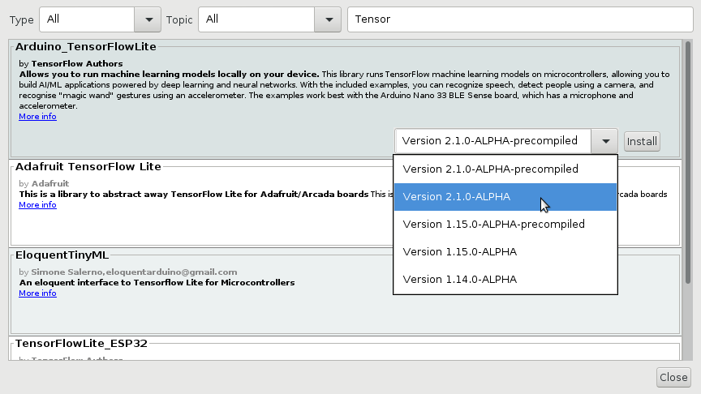
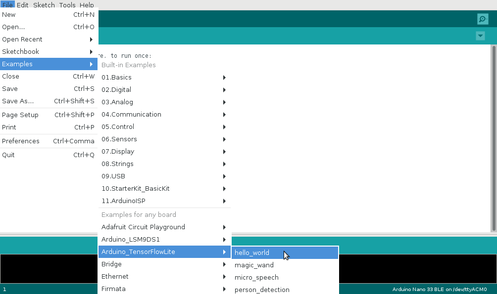
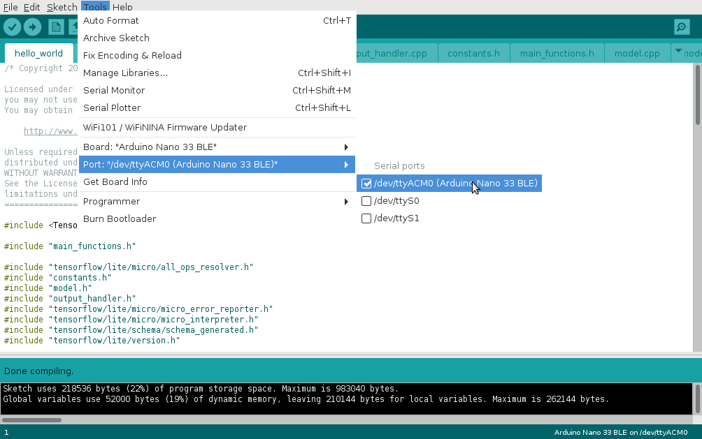
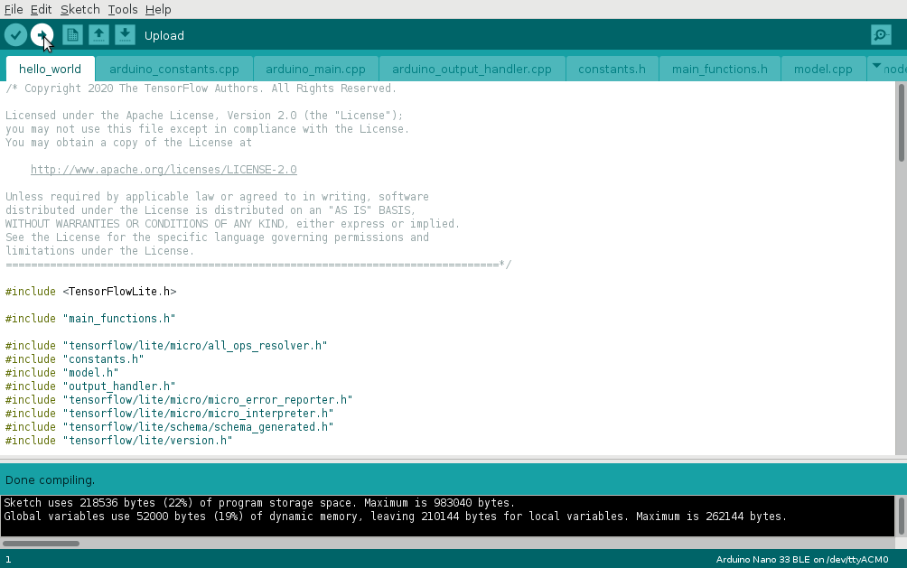

Arduino IDE/CLI integration
===========================

Renode supports integration with `Arduino IDE <https://www.arduino.cc/en/software>`_, making it possible to easily upload and run software targeting Arm-based Arduino boards (currently the Arduino Nano 33 BLE is supported) directly from the IDE.
The same interface can also be used to upload binaries from the console using `Arduino CLI <https://www.arduino.cc/pro/cli>`_.

This document describes how to use the integration layer on a TensorFlow Lite's Hello World project example, but this should work for any custom project as well.

.. note::
    
    The Renode-Arduino integration layer is available on Linux only.

Installing TensorFlow examples
------------------------------

TensorFlow Lite examples do not come preinstalled with Arduino IDE.
In order to add them to your system, select :guilabel:`Tools -> Manage Libraries` and search for the "Arduino_TensorFlowLite" library.
Select the 2.1.0-ALPHA version (**not** the precompiled one) and press the :guilabel:`Install` button:

At the moment, the support for ``USBSerial`` in Renode is still experimental, so you need to patch the library with the following command::

    sed -i'' '/#define DEBUG_SERIAL_OBJECT/s/(Serial)/(Serial1)/' ~/Arduino/libraries/Arduino_TensorFlowLite/src/tensorflow/lite/micro/arduino/debug_log.cpp

This will switch serial output from USBSerial to UART.

.. note::

    Please make sure that the path to installed Arduino libraries is correct.

.. _configuring-renode:

Configuring Renode
------------------

Renode provides the `ArduinoLoader <https://github.com/renode/renode/blob/master/src/Renode/Integrations/ArduinoLoader.cs>`_  pseudo-device that is used to integrate with Arduino IDE/CLI.
It acts as a USB device (CDC/ACM profile) and implements the arduino bootloader protocol (SAM-BA).

In order to connect Renode to Arduino IDE/CLI, perform the following steps:

0. Enable support for USB/IP in the host machine::

    $ sudo modprobe vhci_hcd

1. Create the Arduino Nano 33 BLE platform in Monitor::

      (monitor) mach create
      (machine-0) machine LoadPlatformDescription @platforms/boards/arduino_nano_33_ble.repl

   .. note:: ``ArduinoLoader`` supports any platform based on a Cortex-M CPU.

2. Start the USB/IP server in Renode and attach the loader to it::

      (machine-0) emulation CreateUSBIPServer
      (machine-0) host.usb CreateArduinoLoader sysbus.cpu 0x10000 0 "arduinoLoader"

.. note::

    When creating the loader, you can specify the binary load address (`0x10000` in the case of Arduino Nano 33 BLE board), the port through which the bootloader is connected to the `host.usb` controller (should be changed if you have other devices already connected) and the name of the loader (`arduinoLoader` in this case).

    The values below are the default ones, so you can skip all of them leaving just::

          (machine-0) host.usb CreateArduinoLoader sysbus.cpu

3. Once your simulation is fully set-up and you are ready to receive and run the binary, start the loader::

      (machine-0) arduinoLoader WaitForBinary 120 true

This will automatically connect Renode to the host using the ``usbip`` command (this uses ``sudo`` so you might be asked for your password)
and wait 120 seconds for the binary to be uploaded by the Arduino IDE/CLI.

.. note::

   If you don't want Renode to automatically connect to your host with the usbip command, do not pass the last argument (``true``).
   Remember that in such case you must do it manually before uploading the binary, as otherwise Arduino IDE/CLI won't be able to detect Renode and the process will fail.

Loading from Arduino IDE
------------------------

Start the Arduino IDE and select your sketchbook (in this example we will use the `TensorFlow Lite Hello World <https://github.com/tensorflow/tensorflow/tree/master/tensorflow/lite/micro/examples/hello_world>`_ sample).

.. note::

   The Arduino Nano 33 BLE board support does not come with Arduino IDE by default.
   You need to add it in the :guilabel:`Tools -> Board -> Boards Manager` menu by installing the "Arduino Mbed OS Nano Boards" package.

Select the ``Arduino Nano 33 BLE`` board from the :guilabel:`Tools -> Board -> Arduino Mbed OS Nano Boards` menu.

Compile your project by pressing the :guilabel:`Verify` button.

.. image:: img/arduino_ide_verify.png

Once everything compiles correctly, start ``ArduinoLoader`` in Renode (as described in :ref:`the previous section<configuring-renode>`).

Select the proper ``/dev/ttyACMx`` device as a port from the :guilabel:`Tools -> Port` menu.

Upload the binary by pressing the :guilabel:`Upload` button.

Loading from Arduino CLI
------------------------

You don't have to use the IDE in order to upload the binary - there is also an Arduino CLI tool that allows you to compile and upload your project directly from the command line.

.. note::

   Make sure that ``arduino-cli`` is installed in your system (it does not come with Arduino IDE by default) and available in PATH.
   For details, see the `project's github page <https://github.com/arduino/arduino-cli>`_.

First, compile a project with the following command::

   arduino-cli compile -b arduino:mbed:nano33ble hello_world.ino

Make sure that everything compiles fine and start ``ArduinoLoader`` in Renode (as described in :ref:`the previous section<configuring-renode>`).

Now, upload the binary with the following command::

   arduino-cli upload -b arduino:mbed:nano33ble --port /dev/ttyACM0 hello_world.ino

.. note::

    Please, make sure to select the proper `/dev/ttyACMx` device.

Starting the simulation
-----------------------

Once the binary is received, you'll see the following message in Monitor::

   (machine-0) arduinoLoader WaitForBinary 120 true
   Binary of size 217088 bytes loaded at 0x10000

Now you can start the simulation with::

   (machine-0) showAnalyzer sysbus.uart0
   (machine-0) start

On UART you should see the following output::

   123
   123
   128
   128
   128
   128
   135
   135
   135
   135
   136
   136
   136
   136
   141
   141
   141
   141
   142
   142
   142
   142
   148
   148
   148
   148
   153
   153
   153
   153
   155
   165
   165
   165
   168
   168
   168
   172
   172
   172
   172
   173
   173
   173
   173
   178
   178
   178
   178
   178
   178
   178
   178
   178
   178
   178
   178
   181
   181
   181
   181
   184
   184
