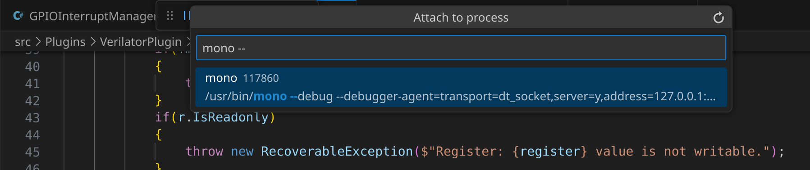

# Developing Renode

Renode has many built-in features to enable debugging of embedded software, e.g. [debugging with GDB](../debugging/gdb.md), but sometimes you might be interested in debugging Renode itself, especially if you are involved in its development

:::{note}
Parts of this chapter are specific to the legacy `mono` runtime.
:::

## Debugging with GDB

To start debugging Renode and its components using [GDB](https://www.sourceware.org/gdb/), follow these steps:

1. Build Renode in debug configuration.

    ```bash
    ./build.sh --mono -d
    ```

1. Launch Renode using Mono with the debugger enabled.

    ```bash
    ./renode -d
    ```

1. Connect to Renode via the Mono debugger, e.g. [using VS Code](#vs-code-configurations)

1. Attach GDB to a running Renode process to also debug implementation of cores (in C via GDB).
    GDB requires specific commands due to Mono using signals for flow control. 
    The most important command is:

    ```
    handle SIGXCPU SIG33 SIG35 SIG36 SIG37 SIGPWR nostop noprint
    ```
(vs-code-configurations)=

## VS Code configurations

Visual Studio Code's extensive plugin ecosystem provides a good developer experience for working with the Renode codebase.
You may decide to use either the official [VS Code](https://code.visualstudio.com/) app from Microsoft or use one of the OSS binary releases [VSCodium](https://github.com/VSCodium/vscodium) or [code-server](https://github.com/coder/code-server).
The main difference between the official and OSS releases is that they use different extensions gallery, so some extensions may be unavailable for each version.

When launching Renode in VS Code, you can use several ready-to-use configurations (as defined in the [`launch.json` file](https://github.com/renode/renode/blob/master/.vscode/launch.json)):

* `Mono Launch - Release` - equivalent to running `./build.sh --mono` and `./renode` from the console.
* `Mono Launch - Debug` - builds Renode in the `Debug` configuration (`./build.sh --mono -d`) and launches it under the Mono debugger.
* `(gdb) Tlib Attach` - required to connect to a previously launched instance of Renode via GDB to debug translation libraries (implementation of emulated cores).

These configurations require the following VS Code extensions:

* [ms-dotnettools.csdevkit](https://marketplace.visualstudio.com/items?itemName=ms-dotnettools.csdevkit)
* [ms-vscode.mono-debug](https://marketplace.visualstudio.com/items?itemName=ms-vscode.mono-debug)
* [ms-vscode.cpptools](https://marketplace.visualstudio.com/items?itemName=ms-vscode.cpptools)

### Launching Renode and debugging

By following the steps below, you will be able to add regular breakpoints in Renode, both in C# and C code.

1. Use the `Mono Launch - Debug` configuration.
It may take a while, as it builds Renode in the debug configuration.

1. When Renode starts, load the platform with a CPU whose code you wish to debug.

1. Use the `(gdb) Tlib Attach` configuration to connect with GDB. 

1. Once started, a popup will appear. In the popup, type in `mono`.

1. From the drop-down list, select the option beginning with `/usr/bin/mono --debug --debuger-agent=...`, as highlighted in the screenshot below.

:::{figure-md}


VSCode Mono drop-down list
:::

### Useful VS Code extensions

Below, you can find a list of VS Code extensions that may prove useful when working with Renode:

* Description
    * [Open VSX Registry](https://open-vsx.org/)
    * [Visual Studio Marketplace](https://marketplace.visualstudio.com/)
* C# support (code completion and debugging)
    * [muhammad-sammy.csharp](https://open-vsx.org/extension/muhammad-sammy/csharp)
    * [ms-dotnettools.csdevkit](https://marketplace.visualstudio.com/items?itemName=ms-dotnettools.csdevkit)
* Mono debugger
    * [ms-vscode.mono-debug on Open VSX](https://open-vsx.org/extension/ms-vscode/mono-debug)
    * [ms-vscode.mono-debug on VS Marketplace](https://marketplace.visualstudio.com/items?itemName=ms-vscode.mono-debug)
* C support (code completion and debugging)
    * [llvm-vs-code-extensions.vscode-clangd](https://open-vsx.org/extension/llvm-vs-code-extensions/vscode-clangd) and [vadimcn.vscode-lldb](https://open-vsx.org/extension/vadimcn/vscode-lldb)
    * [ms-vscode.cpptools](https://marketplace.visualstudio.com/items?itemName=ms-vscode.cpptools)
* CMake support (for standalone Tlib building)
    * [ms-vscode.cmake-tools on Open VSX](https://open-vsx.org/extension/ms-vscode/cmake-tools)
    * [ms-vscode.cmake-tools on VS Marketplace](https://marketplace.visualstudio.com/items?itemName=ms-vscode.cmake-tools)
* Python support
    * [ms-python.python on Open VSX](https://open-vsx.org/extension/ms-python/python)
    * [ms-python.python on VS Marketplace](https://marketplace.visualstudio.com/items?itemName=ms-python.python)
* Robot Framework language server
    * [robocorp.robotframework-lsp on Open VSX](https://open-vsx.org/extension/robocorp/robotframework-lsp)
    * [robocorp.robotframework-lsp on VS Marketplace](https://marketplace.visualstudio.com/items?itemName=robocorp.robotframework-lsp)
* Debugging embedded targets with Renode's GDB server
    * [marus25.cortex-debug on Open VSX](https://open-vsx.org/extension/marus25/cortex-debug) and [webfreak.debug on Open VSX](https://open-vsx.org/extension/webfreak/debug)
    * [marus25.cortex-debug on VS Marketplace](https://marketplace.visualstudio.com/items?itemName=marus25.cortex-debug) and [webfreak.debug on VS Marketplace](https://marketplace.visualstudio.com/items?itemName=webfreak.debug)

:::{note}

Some of these extensions may require additional configuration depending on your machine's setup.
[Tlib](https://github.com/antmicro/tlib/blob/master/CMakeLists.txt) should be first built with CMake to generate the `compile_commands.json` file for `clangd` language services.

:::
