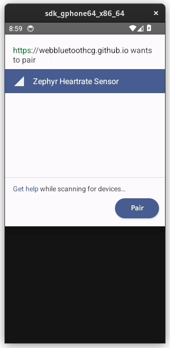
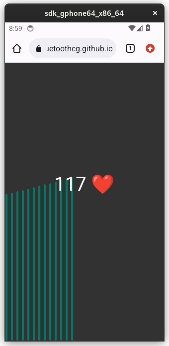

# BLE HCI integration with Renode

The Bluetooth Low Energy standard allows the use of different transports (e.g., UART, USB, SPI) for the HCI protocol.
Integration with an external BLE controller via [HCI UART](https://github.com/zephyrproject-rtos/zephyr/blob/21f473aaecf087e357df19c78ae2bd60aed345dd/samples/bluetooth/hci_uart/README.rst) is supported in Renode and the integration can be used for testing the [BLE host stack in Zephyr RTOS](https://github.com/zephyrproject-rtos/zephyr/blob/21f473aaecf087e357df19c78ae2bd60aed345dd/doc/connectivity/bluetooth/bluetooth-arch.rst#build-types).

## Integration with Android Emulator

[Android Emulator](https://developer.android.com/studio/emulator_archive) (a part of the [Android Studio IDE](https://developer.android.com/studio/intro) that can be also installed as a standalone tool) supports Bluetooth communication through the [netsim tool](https://cs.android.com/android/_/android/platform/tools/netsim/+/a31d6d4930154cf0f211b645667056520a2a7209:;bpv=0;bpt=0).
It is possible to connect Zephyr's BLE host stack emulated in Renode to the channel of `netsim` to test communication between an Android device and an emulated board.

### Building Zephyr samples for a BLE HCI demo

You can find a complete list of Zephyr samples and demos in the [Zephyr Documentation](https://docs.zephyrproject.org/latest/samples/index.html), which describes in detail how to install and use the RTOS.

We will pick [nRF52840 DK](https://docs.zephyrproject.org/latest/boards/arm/nrf52840dk_nrf52840/doc/index.html) board as a sample target. 
To be able to generate some Zephyr binaries on your system, complete the [Zephyr Getting Started Guide](https://docs.zephyrproject.org/latest/getting_started/index.html) first.
Next, create a `nrf52840dk_nrf52840_ble_hci_uart.overlay` file in the `zephyr` directory. This file is used to assign the selected UART to the BLE HCI transport. This file should contain the following content:

```
/ {
	chosen {
		zephyr,bt-uart = &arduino_serial;
	};
};

&arduino_serial {
    status = "okay";
};
```

In most cases, it is possible to create similar overlays for other boards that don't support BLE natively.

Now, you can use the following command to build the [peripheral_hr](https://docs.zephyrproject.org/latest/samples/bluetooth/peripheral_hr/README.html) sample for the nRF52840 DK.
The sample is built with the HCI UART transport enabled:

```
west build -p auto -b nrf52840dk_nrf52840 -d hci_peripheral_hr samples/bluetooth/peripheral_hr -- \
 -DCONFIG_BT_HCI=y -DCONFIG_BT_CTLR=n -DCONFIG_BT_H4=y \
 -DCONFIG_BT_EXT_ADV=n -DCONFIG_BT_HCI_ACL_FLOW_CONTROL=n \
 -DDTC_OVERLAY_FILE=$PWD/nrf52840dk_nrf52840_ble_hci_uart.overlay
```

The built binary should be located in `hci_peripheral_hr/zephyr/zephyr.elf`.

The configuration options used during build may vary depending on the emulated target board and any external BLE controller used during integration.
See [the Zephyr RTOS documentation](https://docs.zephyrproject.org/latest/kconfig.html#!CONFIG_BT) for possible options.

To use these binaries in Renode, load your platform and expose the selected UART to the host via the socket terminal for integration with an external BLE controller:

```
(machine-0) emulation CreateServerSocketTerminal 3456 "ble_hci_uart" false
(machine-0) connector Connect sysbus.uart1 ble_hci_uart
```

You can also use the generic script for the `nrf52840dk_nrf52840` board that is distributed with Renode, you will just need to set some variables for port number (`$port`) and binary path (`$bin`) before loading the script.
You can run this command from the command line:

```
renode -e "$port=3456; $bin=@/home/user/zephyrproject/zephyr/hci_peripheral_hr/zephyr/zephyr.elf; i @scripts/complex/hci_uart/hci_uart.resc"
```

If you try to run the emulation at this point, the Zephyr RTOS will assert a timeout due to a missing connection to the BLE controller.
In the next step, you will learn how to connect to the BLE controller to run the full example.

```{note}
On Linux or macOS, you can also use a {doc}`pty terminal <../host-integration/uart>`.
```

### Setting up Android Emulator

```{note}
Android Emulator version 33.1.14 or later is required to test the Bluetooth integration.
```

Before you can set up the Android emulator from the command line, you need to have the `Java Runtime Environment` installed on your system.
To install the prerequisites on a Debian-based system, use the following command:

```
sudo apt install default-jre unzip wget
```

Now, you can run the following commands to set up Android Emulator:

```{note}
You can set `BASE_PATH` to the directory, where you want to download Android SDK. 
```

```
export BASE_PATH=$HOME

export ANDROID_HOME=$BASE_PATH/android-sdk

export CMDLINE_TOOLS_DIR=$ANDROID_HOME/cmdline-tools
export SDK_LATEST=$CMDLINE_TOOLS_DIR/latest
export EMULATOR_DIR=$ANDROID_HOME/emulator
export PLATFORM_TOOLS_DIR=$ANDROID_HOME/platform-tools

export PATH=$PATH:$EMULATOR_DIR:$PLATFORM_TOOLS_DIR:$SDK_LATEST/bin/
export ANDROID_AVD_HOME=$ANDROID_HOME/system-images

export TEMP_CMDLINE_ZIP=$CMDLINE_TOOLS_DIR/commandlinetools.zip
export TEMP_EMULATOR_ZIP=$ANDROID_HOME/emulator.zip

mkdir -p $CMDLINE_TOOLS_DIR

# https://developer.android.com/studio#command-tools
CMD_DOWNLOAD_URL=https://dl.google.com/android/repository/commandlinetools-linux-9477386_latest.zip

wget -O $TEMP_CMDLINE_ZIP $CMD_DOWNLOAD_URL
unzip $TEMP_CMDLINE_ZIP -d $CMDLINE_TOOLS_DIR
mv $CMDLINE_TOOLS_DIR/cmdline-tools $SDK_LATEST
rm $TEMP_CMDLINE_ZIP

yes | sdkmanager --licenses
sdkmanager --install "platform-tools"
sdkmanager --install "platforms;android-34"

# https://developer.android.com/studio/emulator_archive
EMULATOR_VERSION=33.1.14
EMULATOR_DOWNLOAD_URL=https://redirector.gvt1.com/edgedl/android/repository/emulator-linux_x64-9997245.zip

wget -O $TEMP_EMULATOR_ZIP $EMULATOR_DOWNLOAD_URL
unzip $TEMP_EMULATOR_ZIP -d $ANDROID_HOME
rm $TEMP_EMULATOR_ZIP

sdkmanager --install "system-images;android-34;google_apis;x86_64"

export AVD_NAME_0=Android0
echo "no" | avdmanager --verbose create avd -n $AVD_NAME_0 -k "system-images;android-34;google_apis;x86_64"
```

This script downloads and installs the latest version of the Android SDK command-line tools and the Android Emulator.
It also creates an Android Virtual Device (AVD) named `Android0` based on the Android API level 34 system image.

### Running Renode and Android Emulator together

To transfer HCI packets from the socket terminal created in Renode to the virtual controller in Android, you need to use [bumble](https://google.github.io/bumble/) to decode the gRPC protocol (used by Android Emulator for communication) messages to HCI commands.

```{note}
Don't install `bumble` inside a conda environment, because `socket` module distributed with Anaconda doesn't support Bluetooth sockets.
It will cause an exception while trying to bind to HCI socket:

    AttributeError: module 'socket' has no attribute 'AF_BLUETOOTH'
    Exception: Bluetooth HCI sockets not supported on this platform

You can use:

    pipx install git+https://github.com/google/bumble.git@8eeb58e467 

to install it in an isolated environment.
```

Install the `bumble` module:

```
python -m pip install git+https://github.com/google/bumble.git@8eeb58e467
```

To see, if `bumble-hci-bridge` is available as a global tool, run:

```
bumble-hci-bridge --help
```

Run Android Emulator:

```
emulator -avd Android0 -accel auto -gpu auto
```

Now, you can establish a connection between the Renode device configured in the previous step and the Android emulator using `bumble-hci-bridge`:

```
bumble-hci-bridge tcp-client:127.0.0.1:3456 android-netsim 0x03:0x0031,0x08:0x013,0x08:0x032,0x08:0x016,0x03:0x035
```

To connect Renode with Android Emulator:

1. Start Renode simulation (your platform should connect to the HCI bridge created earlier).
2. On an emulated Android device, open the Chrome browser and go to https://webbluetoothcg.github.io/demos/heart-rate-sensor/.
3. Click on the page and grant permission for Bluetooth access.

You should be able to see and connect to a BLE peripheral emulated in Renode as shown below.

  

## Bluetooth Mesh networking

The Zephyr BLE stack provides support for the BLE Mesh protocol.
You can create a virtual Mesh network with multiple Renode instances emulating separate BLE devices.

### Building the Zephyr BLE Mesh sample

Build the [`mesh` sample](https://github.com/zephyrproject-rtos/zephyr/tree/zephyr-v3.4.0/samples/bluetooth/mesh) that will be loaded in Renode for the `nrf52840dk_nrf52840` platform as follows:

```
west build -p auto -b nrf52840dk_nrf52840 -d hci_mesh samples/bluetooth/mesh -- \
 -DCONFIG_BT_HCI=y -DCONFIG_BT_CTLR=n -DCONFIG_BT_H4=y \
 -DCONFIG_BT_EXT_ADV=n -DCONFIG_BT_HCI_ACL_FLOW_CONTROL=n \
 -DCONFIG_BT_SETTINGS=n -DCONFIG_NVS=n -DCONFIG_SETTINGS=n -DCONFIG_HWINFO=n \
 -DDTC_OVERLAY_FILE=$PWD/nrf52840dk_nrf52840_ble_hci_uart.overlay
```

The built binary should be located in `hci_mesh/zephyr/zephyr.elf`.

### Integration with an external BLE controller

On the host side, you can use tools that provide support for connecting to either physical or virtual BLE controllers: `btvirt` and `btproxy` from [BlueZ](https://github.com/bluez) or `bumble-hci-bridge` and `bumble-link-relay` from [bumble](https://github.com/google/bumble).

The BlueZ use case is described in [Using BlueZ with Zephyr](https://docs.zephyrproject.org/latest/connectivity/bluetooth/bluetooth-tools.html#using-bluez-with-zephyr) and various aspects of BLE integration are well documented in the [bumble project](https://google.github.io/bumble/platforms/index.html), which provides solutions to many [common problems](https://google.github.io/bumble/platforms/linux.html) with permissions.

### Creating virtual controllers

```{note}
This part depends on BlueZ and the `/dev/vhci` device on the host system, so it is limited to Linux hosts.
On other systems, you can test it in a Linux virtual machine.
If you want to run these steps in a Docker container, it should be started with the following flags `--device=/dev/vhci --net=host --cap-add=CAP_NET_ADMIN`. 
```

`btvirt` tool is part of [`bluez-tests` on Ubuntu](https://packages.ubuntu.com/kinetic/amd64/bluez-tests/filelist) and [`bluez-test-tools` on Debian](https://packages.debian.org/bullseye/amd64/bluez-test-tools/filelist).
It can be installed using `apt` package manager.

To build `bluez` from source on a Debian-based system:

```
sudo apt update

sudo apt install -y wget xz-utils git bc libusb-dev libdbus-1-dev libglib2.0-dev libudev-dev libical-dev libreadline-dev autoconf bison flex libssl-dev libncurses-dev libdbus-1-dev python3-docutils cmake udev systemd

wget https://github.com/json-c/json-c/archive/refs/tags/json-c-0.16-20220414.tar.gz
tar xvf json-c-0.16-20220414.tar.gz
cd json-c-json-c-0.16-20220414
mkdir build && cd build
cmake -DCMAKE_INSTALL_PREFIX=/usr -DCMAKE_BUILD_TYPE=Release -DBUILD_STATIC_LIBS=OFF ..
make
sudo make install

wget http://www.kernel.org/pub/linux/bluetooth/bluez-5.68.tar.xz
tar -xvf bluez-5.68.tar.xz
cd bluez-5.68
./configure --enable-mesh --enable-testing --enable-tools --enable-deprecated --enable-experimental --prefix=/usr --mandir=/usr/share/man --sysconfdir=/etc --localstatedir=/var
make -j$(nproc)
```

When built from source, `btvirt` is located in the `emulator` directory.

The number of virtual Bluetooth controllers that can be created with `btvirt` is limited to 16 devices by default.
If you'd like to use Renode to simulate a BLE Mesh network consisting of more devices, you can increase the compile time constant [MAX_BTDEV_ENTRIES](https://github.com/bluez/bluez/blob/5.68/emulator/btdev.c#L251) and rebuild BlueZ.
If you want to exceed 128 virtual devices, you should also increase another constant [MAX_MAINLOOP_ENTRIES](https://github.com/bluez/bluez/blob/5.68/src/shared/mainloop.c#L47).

```{note}
Commands used in this tutorial assume that you don't have any HCI interfaces available on your system.
You can verify it with the `hciconfig` command.
If an HCI interface is already registered, use the appropriate index in `hci-socket:<i>` to account for it.
The `btvirt` command creates HCI for virtual controller.
You can check the created interfaces with `hciconfig`.
```

To create a BLE Mesh network consisting of three devices simulated in Renode communicating each-to-each symmetrically, run the following commands in separate terminals:

```sh
$ sudo btvirt -d -l3
$ renode -e "$port=3456; $bin=@/home/user/zephyrproject/zephyr/hci_mesh/zephyr/zephyr.elf; i @scripts/complex/hci_uart/hci_uart.resc"
$ renode -e "$port=3457; $bin=@/home/user/zephyrproject/zephyr/hci_mesh/zephyr/zephyr.elf; i @scripts/complex/hci_uart/hci_uart.resc"
$ renode -e "$port=3458; $bin=@/home/user/zephyrproject/zephyr/hci_mesh/zephyr/zephyr.elf; i @scripts/complex/hci_uart/hci_uart.resc"
$ sudo capsh --caps="cap_net_admin+eip cap_setpcap,cap_setuid,cap_setgid+ep" --keep=1 --user=\$USER --addamb=cap_net_admin  -- -c "\$(which bumble-hci-bridge) tcp-client:127.0.0.1:3456 hci-socket:0"
$ sudo capsh --caps="cap_net_admin+eip cap_setpcap,cap_setuid,cap_setgid+ep" --keep=1 --user=\$USER --addamb=cap_net_admin  -- -c "\$(which bumble-hci-bridge) tcp-client:127.0.0.1:3457 hci-socket:1"
$ sudo capsh --caps="cap_net_admin+eip cap_setpcap,cap_setuid,cap_setgid+ep" --keep=1 --user=\$USER --addamb=cap_net_admin  -- -c "\$(which bumble-hci-bridge) tcp-client:127.0.0.1:3458 hci-socket:2"
```

You can call `hciconfig` to make sure that virtual HCIs were created by `btvirt`.
You should see HCIs that belong to virtual bus (`Bus: Virtual`).
They disappear after you kill the `btvirt` process.

```
hci2:	Type: Primary  Bus: Virtual
	BD Address: 00:AA:01:02:00:02  ACL MTU: 192:1  SCO MTU: 0:0
	DOWN 
	RX bytes:0 acl:0 sco:0 events:46 errors:0
	TX bytes:523 acl:0 sco:0 commands:46 errors:0

hci1:	Type: Primary  Bus: Virtual
	BD Address: 00:AA:01:01:00:01  ACL MTU: 192:1  SCO MTU: 0:0
	DOWN 
	RX bytes:0 acl:0 sco:0 events:46 errors:0
	TX bytes:523 acl:0 sco:0 commands:46 errors:0

hci0:	Type: Primary  Bus: Virtual
	BD Address: 00:AA:01:00:00:00  ACL MTU: 192:1  SCO MTU: 0:0
	DOWN 
	RX bytes:0 acl:0 sco:0 events:46 errors:0
	TX bytes:523 acl:0 sco:0 commands:46 errors:0
```

```{note}
To be able to test the alternative Zephyr BLE stack running in Renode, make sure to [disable the Bluetooth service](https://github.com/google/bumble/blob/v0.0.161/docs/mkdocs/src/platforms/linux.md#using-hci-sockets).
To see the status of the Bluetooth service on a Debian-based system, run `sudo systemctl status bluetooth`.

In some cases, you may need to use `sudo rfkill unblock all` to unblock your Bluetooth wireless device.
```

Alternatively, you can connect virtual HCI to Renode using the `socat` relay tool and `btproxy`, which is available in the `tools` directory when BlueZ is built from source.
You can use these commands if you do not want to assign temporary extended capabilities to the `bumble-hci-bridge` Python program.

```sh
$ sudo btvirt -d -l3
$ renode -e "$port=3456; $bin=@/home/user/zephyrproject/zephyr/hci_mesh/zephyr/zephyr.elf; i @scripts/complex/hci_uart/hci_uart.resc"
$ renode -e "$port=3457; $bin=@/home/user/zephyrproject/zephyr/hci_mesh/zephyr/zephyr.elf; i @scripts/complex/hci_uart/hci_uart.resc"
$ renode -e "$port=3458; $bin=@/home/user/zephyrproject/zephyr/hci_mesh/zephyr/zephyr.elf; i @scripts/complex/hci_uart/hci_uart.resc"
$ sudo ./tools/btproxy -u"/tmp/bt-server-bredr0" -i 0
$ sudo ./tools/btproxy -u"/tmp/bt-server-bredr1" -i 1
$ sudo ./tools/btproxy -u"/tmp/bt-server-bredr2" -i 2
$ socat TCP-CONNECT:127.0.0.1:3456 UNIX-CONNECT:/tmp/bt-server-bredr0
$ socat TCP-CONNECT:127.0.0.1:3457 UNIX-CONNECT:/tmp/bt-server-bredr1
$ socat TCP-CONNECT:127.0.0.1:3458 UNIX-CONNECT:/tmp/bt-server-bredr2
```

```{note}
You may use TCP server instead of Unix server in `btproxy` with slightly modified commands:

    sudo ./tools/btproxy -l127.0.0.1 -p1000 -i 0
    socat TCP-CONNECT:127.0.0.1:3456 TCP-CONNECT:127.0.0.1:1000
```

Next:

1. Start the Renode simulation (your platform should connect to the HCI bridge you created earlier).
2. Enter `gpio0.sw0 PressAndRelease` in Renode's monitor for each Renode instance to provision BLE devices to Mesh network.
3. All successive button presses (`gpio0.sw0 PressAndRelease`) will cause the message to be sent to other nodes in the network and `led0` blinking on all boards.
4. You can watch `led0` state in Renode's monitor with command `watch "gpio0.led0 State" 200`, which prints the led state every 200 milliseconds.

The following messages should be printed on the `uart0` console:

```
*** Booting Zephyr OS build zephyr-v3.3.0 ***
Initializing...
[00:00:00.041,351] <inf> bt_hci_core: bt_dev_show_info: Identity: C8:7F:54:3D:8E:49 (public)
[00:00:00.041,442] <inf> bt_hci_core: bt_dev_show_info: HCI: version 5.1 (0x0a) revision 0x09a9, manufacturer 0x005d
[00:00:00.041,442] <inf> bt_hci_core: bt_dev_show_info: LMP: version 5.1 (0x0a) subver 0x8a6b
Bluetooth initialized
[00:00:00.041,534] <inf> bt_mesh_prov_device: bt_mesh_prov_enable: Device UUID: 00000000-0000-0000-0000-00000000dddd
Mesh initialized
Self-provisioning with address 0x1fd8
[00:00:08.152,130] <inf> bt_mesh_main: bt_mesh_provision: Primary Element: 0x1fd8
[00:00:08.152,130] <dbg> bt_mesh_main: bt_mesh_provision: net_idx 0x0000 flags 0x00 iv_index 0x0000
Provisioned and configured!
Sending OnOff Set: on
set: on delay: 0 ms time: 0 ms
set: off delay: 0 ms time: 0 ms
set: on delay: 0 ms time: 0 ms
```

BLE devices are emulated in separate Renode instances and communicate in a virtual network through the virtual HCI interfaces owned by the Linux operating system. You can observe traffic on these interfaces in Wireshark using HCI protocol dissector.

If you have multiple computers with physical BLE controller (either USB BLE adapter or built-in BLE module), you can use Renode to emulate BLE devices on different computers and make them communicate in BLE Mesh network to achieve real physical arrangement.

### Integration with a physical BLE controller

An external USB BLE adapter (you can build one from [Zephyr HCI USB sample](https://github.com/zephyrproject-rtos/zephyr/blob/zephyr-v3.4.0/samples/bluetooth/hci_usb/README.rst)) or a built-in BLE module can be used for integration.

To establish a connection between Renode and the USB BLE adapter using `bumble-hci-bridge`:

```
bumble-hci-bridge tcp-client:127.0.0.1:3456 usb:0
```

```{note}
You may need to change the permissions for the USB device to [access it as a regular user](https://github.com/google/bumble/blob/v0.0.161/docs/mkdocs/src/platforms/linux.md#using-a-usb-dongle).
```

You can connect directly to the HCI socket if the kernel has already registered an interface:

```
sudo capsh --caps="cap_net_admin+eip cap_setpcap,cap_setuid,cap_setgid+ep" --keep=1 --user=\$USER --addamb=cap_net_admin  -- -c "$(which bumble-hci-bridge) tcp-client:127.0.0.1:3456 hci-socket:0"
```

```{note}
Do not start the emulation until the bridge is configured, otherwise the BLE host stack may timeout due to lack of connection to the BLE controller.
```
