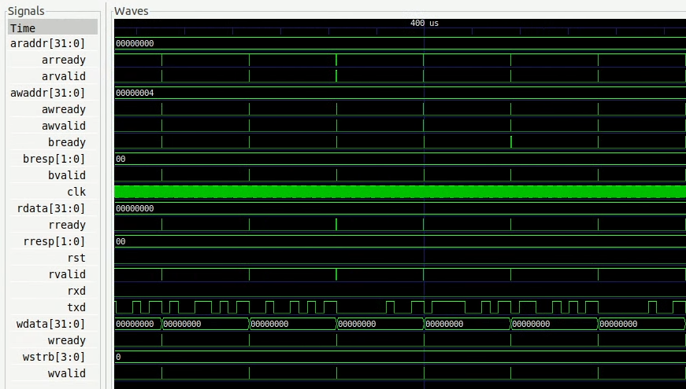

# Co-simulating your verilated model

Creating HDL models and co-simulating them in Renode using Verilator is an advanced topic, so be sure to visit the {doc}`../advanced/co-simulating-with-a-hdl-simulator` chapter beforehand.
If you want to use example verilated models as inspiration to build your own ones, visit [Antmicro's GitHub](https://github.com/antmicro/renode-verilator-integration).

```{note}
You can run this tutorial on Linux and Windows operating systems.
```

## Creating a verilated peripheral

To make your own verilated peripheral, in the main cpp file of your verilated model, you need to include C++ headers applicable to the bus you are connecting to.

You also need to specify the type of external interfaces you want to integrate with Renode - e.g., UART's rx/tx signals.

```
// uart.h and axilite.h can be found in Renode's VerilatorPlugin
#include "src/peripherals/uart.h"
#include "src/buses/axilite.h"
```

Next, you will need to define a function that will call your model's eval function and provide it as a callback to the integration library structure, along with bus and peripheral signals.

```cpp
void eval() {
   top->eval();
   #if VM_TRACE
   main_time++;
   tfp->dump(main_time);
   tfp->flush(); // optional
   #endif
}

void Init() {
AxiLite* bus = new AxiLite();

//==========================================
// Init bus signals
//==========================================
bus->clk = &top->clk;
bus->rst = &top->rst;
bus->awaddr = (unsigned long *)&top->awaddr;
bus->awvalid = &top->awvalid;
bus->awready = &top->awready;
bus->wdata = (unsigned long *)&top->wdata;
bus->wstrb = &top->wstrb;
bus->wvalid = &top->wvalid;
bus->wready = &top->wready;
bus->bresp = &top->bresp;
bus->bvalid = &top->bvalid;
bus->bready = &top->bready;
bus->araddr = (unsigned long *)&top->araddr;
bus->arvalid = &top->arvalid;
bus->arready = &top->arready;
bus->rdata = (unsigned long *)&top->rdata;
bus->rresp = &top->rresp;
bus->rvalid = &top->rvalid;
bus->rready = &top->rready;

//==========================================
// Init eval function
//==========================================
bus->evaluateModel = &eval;

//==========================================
// Init peripheral
//==========================================
uart = new UART(bus, &top->txd, &top->rxd,
   prescaler);
}
```

As part of the last step, in the `main` function, you have to call `simulate` with two port numbers on which Renode awaits communication.

These port numbers are passed as command-line arguments when Renode starts the verilated peripheral.

```cpp
Init();
uart->simulate(atoi(argv[1]), atoi(argv[2]));
```

(building-verilated-peripheral)=

## Building a verilated peripheral

There are a few prerequisites:

* a local copy of [the renode-verilator-integration repository](https://github.com/antmicro/renode-verilator-integration),
* a local copy of [the Renode repository](https://github.com/renode/renode) because of its [VerilatorIntegrationLibrary](https://github.com/renode/renode/tree/master/src/Plugins/VerilatorPlugin/VerilatorIntegrationLibrary),
* Verilator >= v4.024.

`$RVI_PATH`, `$RENODE_PATH`, and `$VERILATOR_PATH`, respectively, will be used to refer to the paths of these three prerequisites.
The path to Verilator won't be needed if it's properly installed, i.e., the executable is available in `PATH` and the `verilator-config.cmake` can be found according to the [CMake's find_package search procedure](https://cmake.org/cmake/help/latest/command/find_package.html#search-procedure).

The path to the directory containing Verilog and C/C++ source files will be referred to as `$SRC_PATH`.
It's best to place that directory directly in the `renode-verilator-integration` repository root which ensures that the default path to the [configure-and-verilate.cmake](https://github.com/antmicro/renode-verilator-integration/blob/master/cmake/configure-and-verilate.cmake) file that contains the CMake logic common to all peripherals is correct.

```{note}
To run shell commands without any modifications, set all ``*_PATH`` shell variables before running the commands.
```

### Preparing the peripheral directory

First, put all Verilog and C/C++ source files in `$SRC_PATH`.
Then, copy the `$RVI_PATH/cmake/CMakeLists.txt.template` as `CMakeLists.txt` to the `$SRC_PATH` directory:

```
# Execute from a directory containing peripheral's source files
mkdir "$SRC_PATH"
cp *.v *.c *.cpp "$SRC_PATH"
cp "$RVI_PATH/cmake/CMakeLists.txt.template" "$SRC_PATH/CMakeLists.txt"
```

The project's `$SRC_PATH/CMakeLists.txt` file needs minor adjustments to work well with a specific peripheral (only the first two are required):

* replace `<PROJECT_NAME>` with a chosen name,
* replace `<MODULE_FILES>` and `<C_SRC_FILES>` with paths to the peripheral files relative to the ``$SRC_PATH``,
* add chosen arguments to be always used during a certain phase of the build by removing `#` and replacing `<ARGS>` with actual arguments in lines that set the `COMP_ARGS`, `LINK_ARGS` and `VERI_ARGS` variables,
* if the peripheral's source directory isn't placed directly in `<RVI_PATH>`, then adjust the path to `configure-and-verilate.cmake` in the `include` command.

```{note}
Use a space to separate multiple files or arguments replacing ``<*_FILES>`` and ``<ARGS>`` placeholders.
```

(build-commands)=

### Build commands

Having the CMake source directory prepared, the verilated peripheral can now be built.
When using CMake, it's best to keep the build files in a separate build directory:

```
mkdir build && cd build
cmake -DCMAKE_BUILD_TYPE=Release -DUSER_RENODE_DIR="$RENODE_PATH" ${VERILATOR_PATH:+"-DUSER_VERILATOR_DIR=$VERILATOR_PATH"} "$SRC_PATH"
make
```

If the build succeeds, `libVtop` is the built verilated peripheral.

```{note}
`RENODE_ROOT` and `VERILATOR_ROOT` environment variables can be used instead of CMake `USER_RENODE_DIR` and `USER_VERILATOR_DIR` variables (respectively).
In case both environment and CMake variables are specified for Renode or Verilator, CMake variables have higher priority.
```

```{note}
Use `make -j $(nproc)` (`make -j $(sysctl -n hw.logicalcpu)` on macOS) to optimize build speed by creating as many jobs as the number of available CPU cores.
```

### Linux-specific build information

On Linux, it is advised to use OpenLibm to enable running verilated peripherals with older GNU libc versions.
This is because a few common mathematical functions have recently been updated in the GNU libm (a part of GNU libc).
If the peripheral is linked against them, you will need these updated functions to run the peripheral.

Pass an additional `-DLIBOPENLIBM=$RVI_PATH/lib/libopenlibm-Linux-x86_64.a` argument to the `cmake` command to use the OpenLibm library that is currently also used by Renode.

### Windows-specific build information

The steps above, with a few minor changes, were tested to successfully build peripherals on Windows with [Cygwin](https://www.cygwin.com/) and [MSYS2](https://www.msys2.org/).
MSYS2 has a well-supported [mingw-w64-verilator](https://packages.msys2.org/base/mingw-w64-verilator) package, so it doesn't require building Verilator.

```{note}
On Windows, it's even more important to use absolute paths.
These could be Cygwin/MSYS2 absolute paths, i.e. `/home/<...>`.
Both Windows and Unix path styles are supported.
```

The CMake command from the [Build commands](build-commands) section requires adding these arguments to work on Windows with Cygwin/MSYS2 and MinGW:

* `-G "MinGW Makefiles"` – to generate a `Makefile` for `MinGW make`,
* `-DCMAKE_SH=CMAKE_SH-NOTFOUND` – required for CMake to work on Windows despite having `sh.exe` in `PATH`.

Additionally, in the most common toolchain setups, the `mingw32-make` command should be used instead of `make` even if both are available.

Therefore, on Windows, a verilated peripheral can be built with:

```
cmake -G "MinGW Makefiles" -DCMAKE_SH=CMAKE_SH-NOTFOUND -DCMAKE_BUILD_TYPE=Release -DUSER_RENODE_DIR="$RENODE_PATH" ${VERILATOR_PATH:+"-DUSER_VERILATOR_DIR=$VERILATOR_PATH"} "$SRC_PATH"
mingw32-make
```

## Running a verilated peripheral

After building a verilated executable, it's time to attach it to a [Renode machine](working-with-machines), so it is actually used as a peripheral.

First, a dedicated peripheral has to be added to a [Renode platform description (.repl) file](describing-platforms) that is going to be used to configure the machine.
For a Verilated UART peripheral called, e.g., `myVerilatedPeripheral`, add these lines into your `.repl` file:

```
myVerilatedPeripheral: Verilated.VerilatedUART @ sysbus <0x70000000, +0x100>
   frequency: 100000000
```

```{note}
The ``Verilated.BaseDoubleWordVerilatedPeripheral`` type should be used instead of ``Verilated.VerilatedUART`` for Verilated peripherals other than UART.
```

```{note}
The example uses communication based on the library calls integration.
To use the socket based intergration you should add the ``address`` parameter to the REPL file and use the `Vtop` binary instead.
```

In Renode, after loading such a platform description with a command either directly in the [Renode monitor](monitor) or with an appropriate [Renode script (.resc) file](scripts), the verilated executable needs to be attached.
Assuming the `libVtop` binary is located in the Renode root directory, it can be attached with:

```
(machine-0) myVerilatedPeripheral SimulationFilePath @libVtop
```

Otherwise, an absolute path or a path relative to the Renode root directory can be used instead of `libVtop`.

```{note}
Paths must start with the `@` symbol or be surrounded by double quotes `"`.
```

## Using Renode Verilator sample peripherals

To build and use one of the verilated peripherals models from the [renode-verilator-integration repository](https://github.com/antmicro/renode-verilator-integration), simply substitute your custom HDL with one of the examples and [follow the same steps as above](building-verilated-peripheral).

```{note}
You can skip **Preparing the peripheral directory** as their directories are prepared already.
```

## Performance of the simulation

You can control the performance of the verilated peripheral in two aspects: its virtual time performance in relation to the main CPU and the real-time performance of execution.

As the example above shows, you need to define the clock frequency for each peripheral.
The `frequency` parameter expects a value in `Hz`.

This value is used to drive the clock signal of the verilated design and is defined in the virtual time domain.
It means that each instruction executed by the CPU, configured with a specific `PerformanceInMips` value, leads to a constant number of clock ticks in the design.
For more details, please see [the chapter on Time Framework](time-framework).

Since it would be impractical to trigger clock signals after every instruction executed by the CPU, you can buffer these events and send them when you reach a certain threshold.
This can be easily configured with the optional `limitBuffer` constructor parameter:

```
myVerilatedPeripheral: Verilated.VerilatedUART @ sysbus <0x70000000, +0x100>
   frequency: 100000000
   limitBuffer: 10000
```

The default value for the `limitBuffer` is 1000000, meaning that Renode will not trigger clock signals until it accumulates 1 million ticks.

## Verilator Trace

You can also enable signal trace dumping by setting the `--trace` or `--trace-fst` Verilator option in `CMakeList.txt` corresponding to your verilated model.

Follow the directions below to ensure correct initialization and use of the verilated dump object.

Firstly, include the following definitions.
These will enable tracing and allow you to switch between `fst` and `vcd` file types with the aforementioned Verilator options.

```cpp
#if VM_TRACE_VCD
# include <verilated_vcd_c.h>
# define VERILATED_DUMP VerilatedVcdC
# define DEF_TRACE_FILEPATH "simx.vcd"
#elif VM_TRACE_FST
# include <verilated_fst_c.h>
# define VERILATED_DUMP VerilatedFstC
# define DEF_TRACE_FILEPATH "simx.fst"
#endif
```

Next, declare the verilated dump object and include collecting signal data with each model evaluation.

```cpp
#if VM_TRACE
   VERILATED_DUMP *tfp;
#endif
vluint64_t main_time = 0;

void eval() {
top->eval();
#if VM_TRACE
   main_time++;
   tfp->dump(main_time);
   tfp->flush();
#endif
}
```

Finally, initialize the verilated dump and run the trace.
If you would like to acquire the verilated dump from your co-simulation ran on sockets, please include this part within the `main()` function; otherwise place it within the `Init()` function.

```cpp
#if VM_TRACE
   Verilated::traceEverOn(true);
   tfp = new VERILATED_DUMP;
   top->trace(tfp, 99);
   tfp->open(DEF_TRACE_FILEPATH);
#endif
```

The resulting trace is written into a vcd or fst file depending on the specified option and can be viewed in, e.g. [GTKWave viewer](http://gtkwave.sourceforge.net/).



## Core-v-mcu "Hello World" example with verilated UART

### Prepare the binary

Instructions on how to set up the SDK are available on the [pulp-builder repository](https://github.com/pulp-platform/pulp-builder/tree/arnold).
After configuration, set the `PULPRT_HOME` environment variable with a path to the `pulp-rules` directory.

You also need to edit the SDK source code.
To write a character to the `txd` UART register, add in `__rt_putc_uart` function in [io.c file](https://github.com/pulp-platform/pulp-rt/blob/eaf528a1926b9e12f94e4aa66e3f5768263db678/libs/io/io.c):

```cpp
*((volatile uint32_t*)(0x50000004)) = c;
```

The "Hello World" code source can be found at [pulp-rt-examples](https://github.com/pulp-platform/pulp-rt-examples/tree/master/hello).
To compile, run:

```
make all io=uart
```

The resulting binary should be created in the `pulp-rt-examples/hello/build/arnold/test` directory.

### Run in Renode simulation

To enable a verilated UART peripheral in the core-v-mcu hello world example, you need to register `VerilatedUART` in [core-v-mcu.repl](https://github.com/renode/renode/blob/master/platforms/cpus/core-v-mcu.repl), e.g.:

```
verilated_uart: Verilated.VerilatedUART @ sysbus <0x50000000, +0x100>
   frequency: 100000000
```

Then, you have to provide a binary to the Renode simulation in the Renode monitor type:

```
(monitor) using sysbus
(monitor) mach create
(machine-0) machine LoadPlatformDescription @platforms/cpus/core-v-mcu.repl
```

Attach your binary to the simulation:

```
(machine-0) sysbus LoadELF @path_to_your_binary
```

You can use your verilated UART model:

```
(machine-0) verilated_uart SimulationFilePath @path_to_verilated_uart_model
```

Or you can use the prebuilt one provided by us:

```
(machine-0) $uart?=@https://dl.antmicro.com/projects/renode/verilator--uartlite_trace_off-s_252704-c703fe4dec057a9cbc391a0a750fe9f5777d8a74
(machine-0) verilated_uart SimulationFilePath $uart
```

To enable the UART analyzer window and start simulation, type:

```
(machine-0) showAnalyzer verilated_uart
(machine-0) s
```
