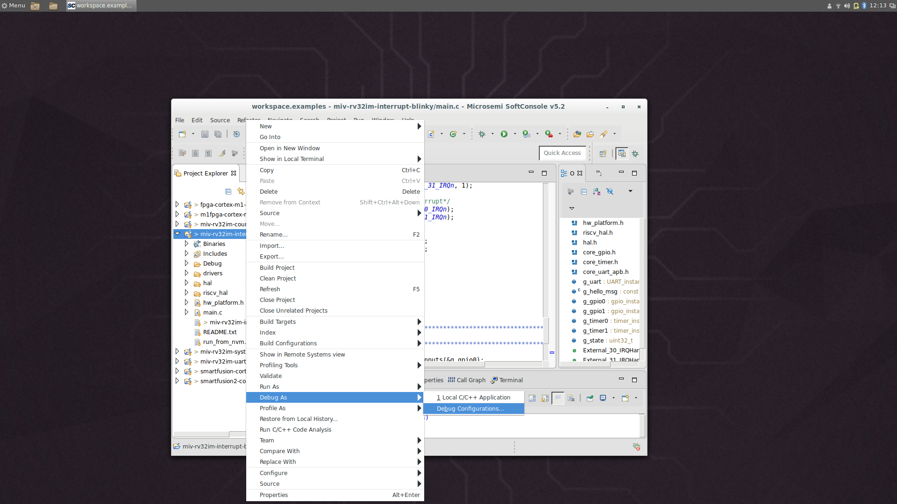
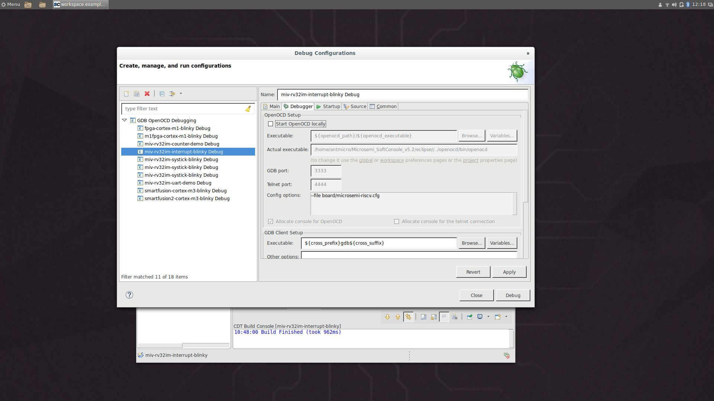
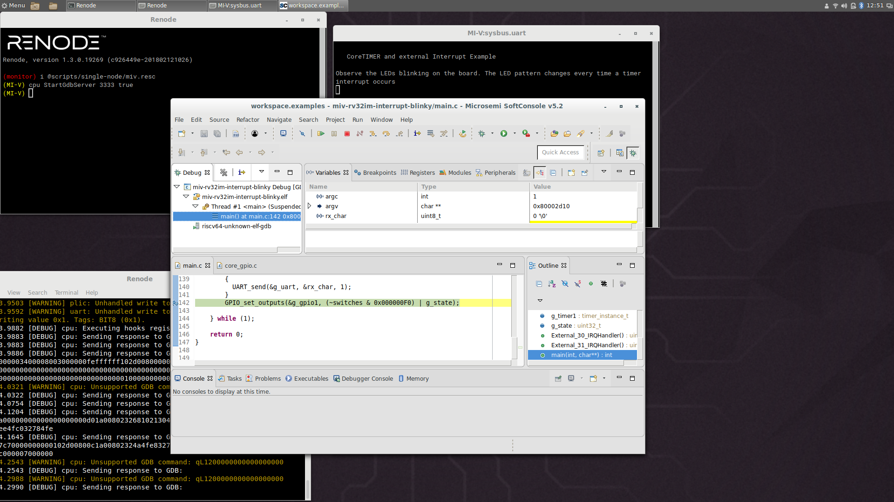

# Microsemi Mi-V example

In this tutorial you will learn how to setup a fully functional emulation of a single Mi-V board by Microsemi, with a RISC-V CPU.
It covers topics ranging from installing Renode, through basic commands, to the process of [integrating with Microsemi's SoftConsole IDE](#softconsole-integration).

While this tutorial focuses on a single Mi-V platform, Renode supports multiple devices running in the same simulation - and it should be fairly simple to extend this scenario to multiple interconnected nodes.

## Installation

The Renode framework is hosted [on GitHub](https://github.com/renode/renode).
You can download and install it following the process described in the [README](https://github.com/renode/renode/blob/master/README.md) file, but the easiest way to start is by downloading a binary release from <https://github.com/renode/renode/releases>.
The precompiled packages are provided as deb and rpm packages for Linux, dmg package for macOS and a zip archive for Windows.

## Starting Renode

One of the many ways to interact with Renode is via its command line interface.

After installing Renode, you should be able to run the `renode` command from your command line.
Alternatively, look for the Renode.exe binary.
Once Renode is started, you will see two windows - one for Renode's smart logger and one for the CLI called "the Monitor".

From this window you will be able to create and control the whole emulation environment.

## Scripts

While you can type all commands interactively, it's a good idea to group them into reusable Renode scripts, which typically have the ".resc" extension.
Their purpose is to load binaries, set starting conditions, prepare the environment, connect machines to the network etc.

For the purpose of this article we will use the script available in the Renode package named: {script}`scripts/single-node/miv.resc <single-node/miv.resc>`.
For details about the particular script you will be running, please inspect the file in the Renode installation directory (e.g. for Linux it is "/opt/renode/scripts").

## Loading our setup

The provided script creates a single machine and loads a sample LiteOS-based application.

To run a script, use the `include` command (or `i`, for short), with a path to the script to load, prepended with the `@` sign, like this:

```none
include @scripts/single-node/miv.resc
```

After the script is loaded, you will see a new terminal - a UART window opened by the `showAnalyzer` command.

In the provided scripts, we're using precompiled binaries hosted online, but you can provide your own binaries by setting the `$bin` variable before loading the script:

```none
$bin=@path/to/application.elf
```

The emulation is now loaded, but not started.
You can control it using `start` and `pause` - and other commands, as described in the next section.

## Simple commands

### Start and pause

To control whether the simulation is running, use `start` and `pause`.

### Machines

In the provided script, we use the `mach create` command to create the machine.
This switches the context in the Monitor.
All subsequent commands are executed with regard to the current machine.

To change the machine use the `mach set` command.
Use a number or the name of the machine, e.g. `mach set 1` or `mach set "MI-V"`.

All machines can be listed with the `mach` command.
To clear the current selection use `mach clear`.

### Accessing peripherals

All peripherals are accessible in the Monitor, with most of their methods and properties exposed to the user.
To list all available peripherals use the `peripherals` command.

### Peripheral methods and properties

To access a peripheral you have to provide its fully qualified name.
All peripherals are registered in `sysbus`, so use `sysbus.uart` to access the UART or `sysbus.gpioOutputs.led0` to access one of the LEDs.

The `using sysbus` command is used in most of the provided demos, allowing you to drop the `sysbus.` prefix.

Typing a peripheral's name gives you a list of available methods, fields and properties.
The list is automatically generated, so most of the accessible members are not designed for the end-user.

The list shows examples of correct Monitor syntax for each member type.

### Other commands

To find information about built-in Monitor commands, type `help` and refer to the documentation.
Running `help builtin_command_name` prints out the help for the given command.

## Debugging and inspection

Renode offers you many ways to verify the behavior of your applications.
Thanks to having full control over the environment, you can add logging, hooks on events, interactive code debugging and more in a way that is 100% transparent to the emulated application.

Here we will present just a few of the available debugging options.

### Function name logging

When the application is stuck or misbehaves it is always a good idea to inspect the trace of function calls.
To enable logging of function names in a selected machine run `cpu LogFunctionNames true` (and `false`, respectively, to disable it).

Since the amount of logged data may be too overwhelming to be useful, you can filter the logged functions to the ones that begin with a specified prefix.
For example `cpu LogFunctionNames true "UART_ LOS_"` will only log functions that begin with either "UART_" or "LOS_" prefix.

### Logging of peripheral accesses

If your driver does not behave correctly, it may be a good idea to investigate the communication with the device it controls.
To enable logging of each interaction between the CPU and the UART peripheral, run `sysbus LogPeripheralAccess uart`.

This feature is available only for peripherals registered directly on the system bus.

### GDB

A popular tool for debugging, GDB, can be used to analyze applications running in Renode.
It uses the same remote protocol as OpenOCD, so it can be easily integrated with most GDB-based IDEs, such as SoftConsole or Eclipse.
To start a GDB stub in Renode, run `machine StartGdbServer 3333` (where 3333 is a sample port number) and connect from GDB by calling `(gdb) target remote :3333`.
To start the emulation you have to run both `start` in Renode and `continue` in GDB.

You can use most of GDB's regular features: breakpoints, watchpoints, stepping, reading/writing to variables, etc.
You can also use the `monitor` command in GDB to send commands directly to the Renode CLI (to avoid switching between two console windows).

## SoftConsole integration

One of the Renode's main goals is to easily integrate with tools that are used for a developer\'s everyday work.
A great example of such a tool is [SoftConsole, an Eclipse-based IDE from Microsemi](https://www.microsemi.com/product-directory/design-tools/4879-softconsole).

SoftConsole offers debugging capabilities that can be normally used when attached to hardware.
By altering the project settings you can connect it to Renode.

Start by running the GDB server in renode:

```none
(monitor) include @scripts/single-node/miv.resc
(MI-V) machine StartGdbServer 3333 true
```

Please note the `true` parameter - it forces Renode to autostart as soon as the GDB client connects.

Now you need to configure the debug configuration in SoftConsole.

In the Project Explorer, right click on your project's name, select `Debug As` and `Debug Configurations...`.



This opens a window, where you need to open the `Debugger` tab.
There, uncheck the checkbox `Start OpenOCD locally`, as Renode will serve the same purpose as OpenOCD usually does.



You must verify that the remote port number in the `Remote Target` section is the same as the one provided in the `StartGdbServer` command.

With these changes in place, you can now click `Debug`.
SoftConsole will connect to Renode and the emulation will start automatically.

By default, you will observe a breakpoint at the beginning of the `main` function being hit.

In SoftConsole you can add your own breakpoints, inspect and change variables and step over your code, while still being able to interact with Renode in the usual way, via the Monitor.


